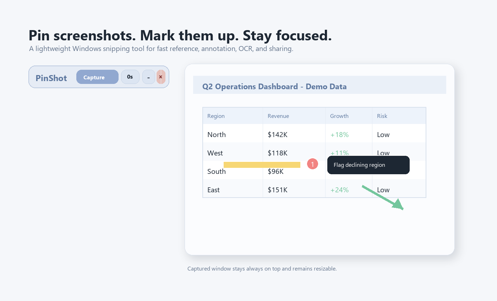
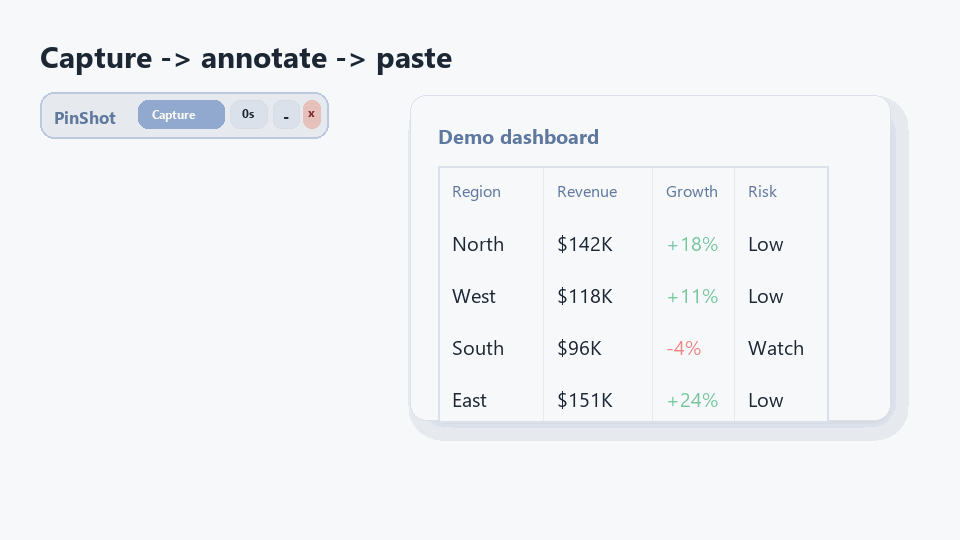
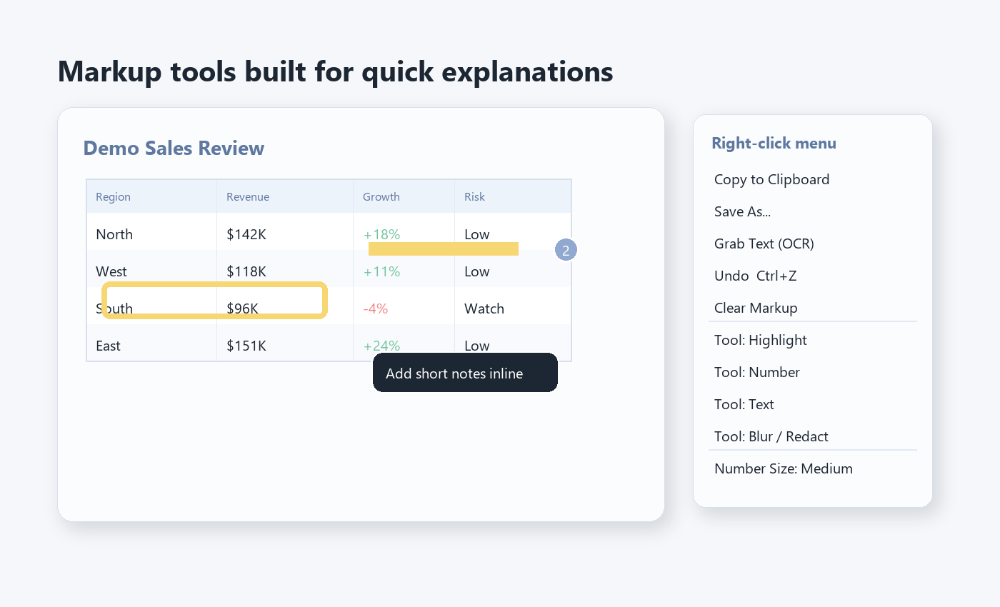
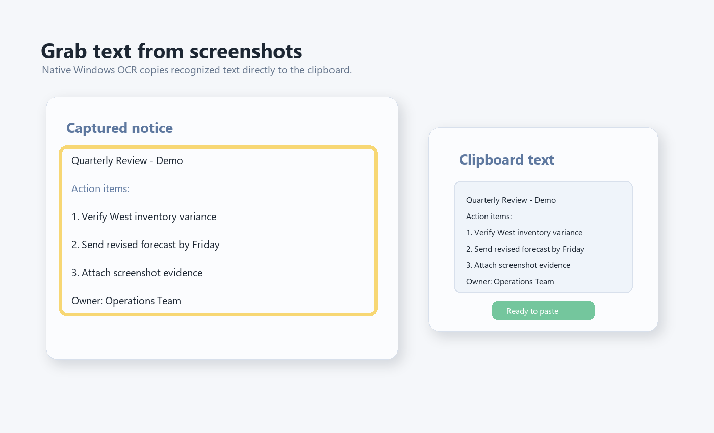
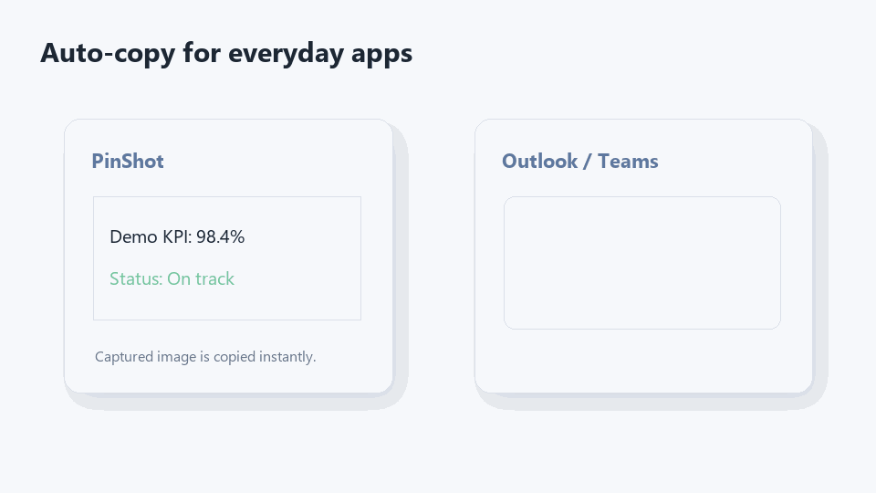

# PinShot

Lightweight Windows screenshot pinning tool. Capture up to 10 screenshots and keep them floating above all other windows.

PinShot is built for one focused job: quickly capture reference screenshots and keep them visible while you work. Snip any rectangular region, pin up to 10 resizable screenshots on top of every other window, then mark them up, copy, save, or extract text when needed.

---

## Preview

> Demo images use mock data only.



### Capture and pin while you work



### Markup and sharing

| Annotation tools | OCR to clipboard |
|---|---|
|  |  |

### Clipboard-ready screenshots



---

## Download

**Latest release: [download `PinShot.zip` from Releases](../../releases/latest)**

Extract anywhere and double-click `PinShot.exe`. No installer. No admin rights. No Python.

> *On first launch, Windows SmartScreen may show "Unknown publisher" — click **More info → Run anyway**. The build is unsigned (it's a free hobby project) and reproducible from source.*

---

## Features

### Core workflow
- Capture up to **10 screenshots** at the same time
- Every screenshot stays **floating above all other windows**
- Resize each pinned screenshot freely
- Close one screenshot or clear all pinned screenshots from the toolbar

### Capture
- Drag-select any rectangular region across **all monitors** (full virtual desktop)
- **Snap-to-window-edges** while dragging (8 px threshold) — hold `Shift` for a perfect square
- **Timed capture**: 0 / 3 / 5 / 10 second delay (frozen-screen mode preserves dropdown menus)
- Live `W × H` readout while selecting
- **Pixel-precise magnifier loupe** at the cursor with a 21×21 zoom, crosshair, hex code and on-screen coordinates
- `Esc` cancels selection any time

### Pinned screenshot windows
- Up to **10 floating, always-on-top, freely resizable** screenshot windows simultaneously
- Indices reuse — closing #2 frees up #2 for the next capture
- One-click **Close All** in the toolbar

### Markup tools (right-click any pinned screenshot)
| Tool | What it does |
|---|---|
| Highlight | Translucent freehand stroke (RDP simplification + Catmull-Rom smoothing) |
| Rectangle | Outline a region |
| Rectangle (filled) | Translucent fill + outline |
| Ellipse / Ellipse (filled) | Outlined or translucent oval |
| Arrow | Sleek arrow with proportional head |
| Number | 1, 2, 3 markers — auto-renumber on undo |
| Text | Inline text annotation with soft backdrop |
| Spotlight | Dim everything outside a chosen rectangle |
| Blur / Redact | Pixelate sensitive regions |

- Colors: Yellow, Red, Green, or any custom hex
- `Ctrl+Z` undo per window — accumulates as you edit
- Adjustable **Number Size** (Small / Medium / Large / Extra Large) — DPI-aware, targets ~1 cm physical diameter

### Sharing & extraction
- **Auto-copied to clipboard** the moment a screenshot is taken
- **Copy to Clipboard** (after edits) — supports both `CF_DIB` (Outlook, Word, Teams) and `CF_PNG` (modern web apps)
- **Save As…** — PNG (lossless, ~135 ms encode for 1080p), WebP (lossless, 35–65% smaller than PNG), JPEG (q92, optimised), BMP. Encodes happen on a background thread.
- **Pick Color at Cursor** — copies hex, shows OkLab/OKLCH readout + perceptual delta-E to white/black
- **Magnify Region** — floating loupe that follows the cursor on a pinned screenshot
- **Grab Text** — native Windows OCR copies extracted text straight to your clipboard

### System tray
- Minimize the toolbar to the system tray
- Tray menu: Capture / Show PinShot / Quit
- Capture from the tray without restoring the toolbar

### Persistence
Saved to `%LOCALAPPDATA%\PinShot\pinshot.json`:
- Last save folder
- Last delay choice
- Default tool / color / number size
- Toolbar position
- First-run dialog suppression

Crash logs at `%LOCALAPPDATA%\PinShot\pinshot.log` (rotating, capped at 512 KB × 2 backups).

---

## Performance

- **Cold launch**: ~0.6–0.8 sec from double-click to toolbar visible (PyInstaller `--onedir` with stripped stdlib modules)
- **Stroke commit**: ~1 ms regardless of how many strokes already exist (dirty-rect compositing)
- **Resampling**: LANCZOS for sharp display at any window size; 1:1 native rendering by default
- **Single-instance enforcement** via Win32 named mutex — second launch surfaces the existing toolbar instead of duplicating it
- **Per-monitor DPI awareness** so markup looks the right physical size on any monitor

---

## How to use

1. Launch `PinShot.exe` and click **Capture**.
2. Optionally pick a 3 / 5 / 10 sec delay from the dropdown.
3. Hover the screen — a magnifier loupe shows pixel detail.
4. Click and drag to select; snap to window edges or hold `Shift` for a square.
5. Release the mouse — the screenshot appears AND is auto-copied to your clipboard.
6. Resize the floating window by dragging its edges/corners.
7. Left-click and drag on a screenshot to apply the current markup tool.
8. Right-click for the full action menu (tool, color, number size, copy, save, OCR, magnify, undo, clear, close).
9. Drag the toolbar to reposition — PinShot remembers its location.
10. Click `–` to minimize to tray, `✕` to quit. Click the **PinShot** wordmark for the About dialog.

---

## Build from source

If you'd rather build the binary yourself:

```bash
# Requirements: Windows 10/11, Python 3.11+, pip
git clone https://github.com/<your-username>/pinshot.git
cd pinshot
pip install -r requirements.txt
build.bat
```

Output:
- `dist\PinShot\PinShot.exe` — the application (folder build, fast cold-start)
- `dist\PinShot.zip` — the distributable zip (drop anywhere and run)

---

## Repository layout

```
pinshot/
├── assets/               # README screenshots and short demo GIFs
├── screenshot_tool.py    # The whole app (single Python file)
├── pinshot.ico           # App icon
├── PinShot.spec          # PyInstaller build spec
├── build.bat             # One-shot build script
├── requirements.txt      # Pillow, PyInstaller, pystray, winrt-* (OCR)
├── README.md             # This file
└── LICENSE               # MIT
```

---

## License

[MIT](LICENSE) — free to use, modify, and redistribute. Provided as-is, no warranty.

---

## Support the project

PinShot is built and maintained by Jim as a free product, with no ads, no telemetry, no paywall. If it saves you time or makes your day a little smoother, a star on this repo or a kind word goes a long way.

For questions, bugs, or feature requests, open an issue.
